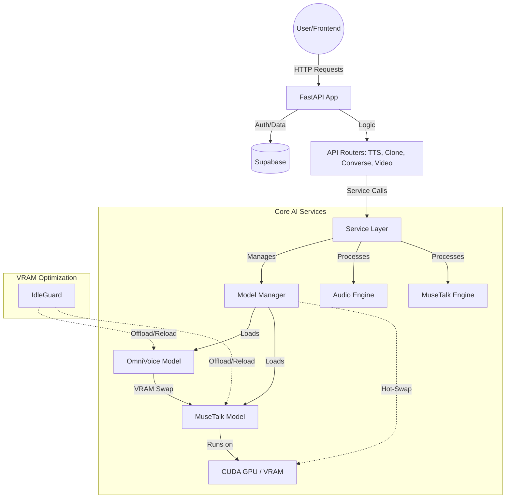

# OmniCast Backend: The Ultimate AI Voice & Video Engine Architecture

This document provides a comprehensive, deep-dive analysis of the OmniCast Backend—a state-of-the-art system designed for high-performance AI voice synthesis, zero-shot cloning, and real-time Video-to-Video lip-syncing using MuseTalk.

---

## 1. High-Level Architecture

The OmniCast Backend is built on **FastAPI** and powered by the **OmniVoice** and **MuseTalk** engines. It is designed to handle heavy AI workloads efficiently while maintaining a low memory footprint through VRAM hot-swapping.

---

## 2. Directory Structure

| Directory | Purpose |
| :--- | :--- |
| `app/api/` | RESTful endpoints (TTS, Cloning, Video/Avatar Generation). |
| `app/core/` | Global configuration, security (JWT), logging, and DB clients. |
| `app/services/` | Business logic for OmniVoice and MuseTalk engines. |
| `app/utils/` | Utility functions for VRAM management and hot-swapping. |
| `models/omnivoice` | Local storage for OmniVoice weights. |
| `models/musetalk` | Local storage for MuseTalk UNet and weights. |

---

## 3. Core Logic & File Breakdown

### A. The Orchestrator: `app/services/model_manager.py`
This is the central control unit for multi-model management.
- **Model Registry**: Manages singletons for both OmniVoice and MuseTalk.
- **VRAM Hot-Swapping**: Implements logic to swap models between GPU and CPU. Since the GPU (8GB) cannot hold both models simultaneously at full performance, the manager moves OmniVoice to CPU before loading MuseTalk for video generation.
- **IdleGuard integration**: Each model has its own watchdog that offloads it to CPU after a period of inactivity.

### B. The Lip-Sync Engine: `app/services/musetalk_engine.py`
Wrapper for the MuseTalk UNet model.
- **Latent Space Inpainting**: Modifies the mouth region of video frames based on audio features.
- **Feature Extraction**: Uses Whisper features for audio and Face Alignment for video bounding boxes.
- **In-Memory Processing**: Frames are kept in RAM as numpy arrays during inference to avoid I/O bottlenecks.

### C. The Video Endpoint: `app/api/video.py`
Handles the `/generate-avatar` workflow.
1.  **Audio First**: Uses the existing OmniVoice pipeline to generate high-quality speech from text.
2.  **Swap**: Triggers a VRAM swap to offload OmniVoice and load MuseTalk.
3.  **Sync**: Runs the MuseTalk inference loop to generate the lip-synced video frames.
4.  **Mux**: Finalizes the video by multiplexing the generated audio with the processed frames.

---

## 4. Key Technologies

- **FastAPI**: Asynchronous web framework.
- **OmniVoice**: Instruction-based TTS with zero-shot cloning.
- **MuseTalk**: Latent space inpainting for high-fidelity lip-syncing.
- **Diffusers**: Used for running the MuseTalk UNet.
- **FFmpeg**: For A/V extraction and multiplexing.

---

## 5. Why it's the "Best in the Universe"

1.  **Dynamic VRAM Management**: Seamlessly switches between heavy models on an 8GB GPU.
2.  **End-to-End Pipeline**: A single request transforms raw text and a reference video into a fully voiced, lip-synced avatar.
3.  **Low Latency**: Aggressive caching and in-memory frame processing minimize processing time.
4.  **Modular Design**: The separation of model logic from the API layer allows for easy updates to individual AI engines.
e.